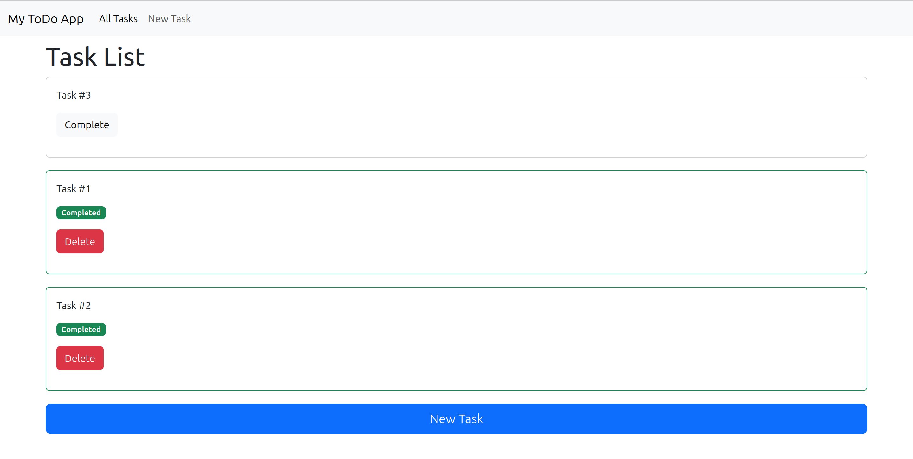

# ToDo App Documentation

Welcome to my ToDo app!



## Overview
This project is a simple **ToDo application** built using the **Laravel framework** with **PHP** as the programming language. It allows users to manage tasks through full **CRUD** operations — **Create**, **Read**, **Update**, and **Delete**.

## Technologies Used
- **Backend Framework**: Laravel (PHP)
- **Programming Language**: PHP
- **Database**: SQLite3

## Features
- **Create** new tasks with a title and description.
- **View** a list of all existing tasks.
- **Update** task details.
- **Delete** tasks when they are no longer needed.

## Database
The application uses **SQLite3** for data storage. 
- The database file is lightweight and ideal for development and small applications.
- Database configuration is handled in the Laravel `.env` file by setting:
  ```plaintext
  DB_CONNECTION=sqlite
  DB_DATABASE=/absolute/path/to/database.sqlite

## UI Framework

For the user interface, I used **[Bootstrap 5](https://getbootstrap.com/)**, a popular CSS framework, to ensure a responsive, clean, and mobile-friendly design.

- **Responsive layout**: Bootstrap’s grid system automatically adjusts the layout for mobile, tablet, and desktop screens.
- **Pre-built components**: Buttons, forms, modals, and other UI elements are styled using Bootstrap's components.
  
Here’s an example of the UI: